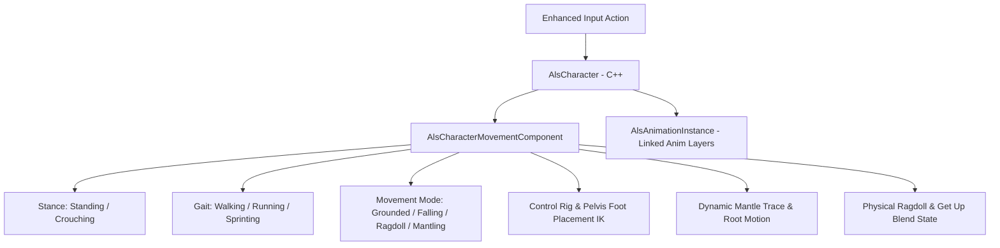

# ALS Refactored Locomotion — WebSpider Studios


**ALS Refactored Locomotion** is a production-ready C++ character locomotion, parkour, and dynamic ragdoll framework developed and extended by **WebSpider Studios (Vivekanand Rajbhar)**, built for Unreal Engine 5.

It modernizes the iconic Advanced Locomotion System V4 with native Linked Animation Layers, Control Rig foot IK, curve-driven transitions, and high-fidelity multiplayer replication.

---

## 🏃 Movement Architecture



### 1. Locomotion & Gait Control
* **Movement Modes**: Seamless blend between Grounded, In-Air, Mantling, and Ragdoll states.
* **Gait Mechanics**: Distinct locomotion speeds and curves for Walking, Running, and Sprinting with acceleration banking and deceleration skids.
* **Rotation Modes**: Velocity Direction, Looking Direction, and Aiming Direction with procedural spine lean and head tracking.

### 2. Procedural & Physical Systems
* **Dynamic Mantling**: 2-stage raycast and sphere trace system detecting ledges, obstacle heights, and low vaults with root-motion synchronization.
* **Dynamic Ragdoll & Recovery**: Real-time transition to physics simulation upon high-impact collisions with automatic front/back get-up montage selection.
* **Foot Placement IK**: Pelvis offset compensation with trace-driven foot and toe alignment across uneven terrain.

### 3. Modular Architecture
* Fully modularized into `ALS`, `ALSCamera`, `ALSExtras`, and `ALSEditor` runtime and uncooked modules.
* Clean separation between character movement math in C++ and visual presentation in Linked Animation Blueprints.

---

## 🛠️ How to Build and Run in Unreal Engine

### Prerequisites
* **Unreal Engine**: 5.8 or 5.7 installed via Epic Games Launcher
* **IDE**: Visual Studio 2022 (with *Game Development with C++* workload)
* **OS**: Windows 10/11 (64-bit)

### Steps
1. Clone this repository:
   ```bash
   git clone https://github.com/VR-WebSpider/ALSRefactoredLocomotion.git
   ```
2. Right-click `ALSRefactoredLocomotion.uproject` and select **Generate Visual Studio project files**.
3. Open `ALSRefactoredLocomotion.sln` in Visual Studio 2022.
4. Set the build configuration to **Development Editor** and platform to **Win64**.
5. Launch the project (F5 or double-click `ALSRefactoredLocomotion.uproject`).
6. Open the ALS demonstration map located in `/ALS/Maps/` to test traversal, obstacle mantling, and ragdoll recovery.

---

## 🏢 Credits & Attribution

* Developed and extended by **WebSpider Studios (Vivekanand Rajbhar)**.
* Built upon foundational C++ refactored locomotion architecture authored by **Sixze** and community contributors. Licensed under the [MIT License](LICENSE).